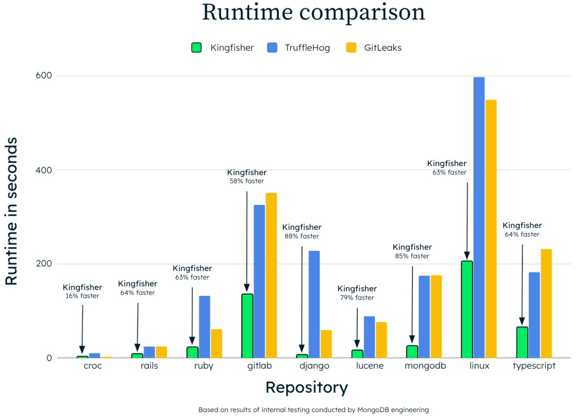

# Kingfisher

<p align="center">
  

[](https://opensource.org/licenses/Apache-2.0)<br>
[](https://github.com/mongodb/kingfisher/pkgs/container/kingfisher)


Kingfisher is a blazingly fast secret‑scanning and live validation tool built in Rust. It combines Intel’s SIMD accelerated regex engine (Hyperscan) with language‑aware source code parsing, and **ships with hundreds of built‑in rules** to detect, validate, and triage secrets before they ever reach production
</p>

Originally forked from Praetorian’s Nosey Parker, Kingfisher has since significantly expanded and diverged, adding live validation, 10+ new scan targets, and major architectural enhancements. See [Origins and Divergence](#origins-and-divergence) for details.

## Key Features

### Multiple Scan Targets
<div align="center">

| Files / Dirs | Local Git | GitHub | GitLab | Azure Repos | Bitbucket | Gitea | Hugging Face |
|:-------------:|:----------:|:------:|:------:|:-------------:|:----------:|:------:|:-------------:|
| <br/><sub>Files / Dirs</sub> | <br/><sub>Local Git</sub> | <br/><sub>GitHub</sub> | <br/><sub>GitLab</sub> | <br/><sub>Azure Repos</sub> | <br/><sub>Bitbucket</sub> | <br/><sub>Gitea</sub> |<br/><sub>Hugging Face</sub> |

| Docker | Jira | Confluence | Slack | AWS S3 | Google Cloud |
|:------:|:----:|:-----------:|:-----:|:------:|:---:|
| <br/><sub>Docker</sub> | <br/><sub>Jira</sub> | <br/><sub>Confluence</sub> | <br/><sub>Slack</sub> | <br/><sub>AWS&nbsp;S3</sub> |  <br/><sub>Cloud Storage</sub> |

</div>

### Performance, Accuracy, and Hundreds of Rules
- **Performance**: multithreaded, Hyperscan‑powered scanning built for huge codebases  
- **Extensible rules**: hundreds of built-in detectors plus YAML-defined custom rules ([docs/RULES.md](/docs/RULES.md))  
- **Broad AI SaaS coverage**: finds and validates tokens for OpenAI, Anthropic, Google Gemini, Cohere, Mistral, Stability AI, Replicate, xAI (Grok), Ollama, Langchain, Perplexity, Weights & Biases, Cerebras, Friendli, Fireworks.ai, NVIDIA NIM, Together.ai, Zhipu, and many more
- **Compressed Files**: Supports extracting and scanning compressed files for secrets
- **Baseline management**: generate and track baselines to suppress known secrets ([docs/BASELINE.md](/docs/BASELINE.md))

**Learn more:** [Introducing Kingfisher: Real‑Time Secret Detection and Validation](https://www.mongodb.com/blog/post/product-release-announcements/introducing-kingfisher-real-time-secret-detection-validation)

# Benchmark Results

See ([docs/COMPARISON.md](docs/COMPARISON.md))

<p align="center">
  
</p>

# Table of Contents

<details>

- [Kingfisher](#kingfisher)
  - [Key Features](#key-features)
    - [Multiple Scan Targets](#multiple-scan-targets)
    - [Performance, Accuracy, and Hundreds of Rules](#performance-accuracy-and-hundreds-of-rules)
- [Benchmark Results](#benchmark-results)
- [Table of Contents](#table-of-contents)
- [Getting Started](#getting-started)
  - [Installation](#installation)
    - [Pre-built Releases](#pre-built-releases)
    - [Homebrew](#homebrew)
    - [Linux and macOS](#linux-and-macos)
    - [Windows](#windows)
    - [Compile](#compile)
    - [ Run Kingfisher in Docker](#-run-kingfisher-in-docker)
- [🔐 Detection Rules at a Glance](#-detection-rules-at-a-glance)
  - [📝 Write Custom Rules!](#-write-custom-rules)
- [🎉 Usage](#-usage)
  - [Basic Examples](#basic-examples)
    - [Scan with secret validation](#scan-with-secret-validation)
    - [Scan a directory containing multiple Git repositories](#scan-a-directory-containing-multiple-git-repositories)
    - [Scan a Git repository without validation](#scan-a-git-repository-without-validation)
    - [Display only secrets confirmed active by third‑party APIs](#display-only-secrets-confirmed-active-by-thirdparty-apis)
    - [Output JSON and capture to a file](#output-json-and-capture-to-a-file)
    - [Output SARIF directly to disk](#output-sarif-directly-to-disk)
    - [Pipe any text directly into Kingfisher by passing `-`](#pipe-any-text-directly-into-kingfisher-by-passing--)
    - [Limit maximum file size scanned (`--max-file-size`)](#limit-maximum-file-size-scanned---max-file-size)
    - [Scan using a rule _family_ with one flag](#scan-using-a-rule-family-with-one-flag)
    - [Display rule performance statistics](#display-rule-performance-statistics)
    - [Scan while ignoring likely test files](#scan-while-ignoring-likely-test-files)
    - [Exclude specific paths](#exclude-specific-paths)
    - [Scan changes in CI pipelines](#scan-changes-in-ci-pipelines)
  - [ Scanning an AWS S3 Bucket](#-scanning-an-aws-s3-bucket)
  - [ Scanning a Google Cloud Storage Bucket](#-scanning-a-google-cloud-storage-bucket)
  - [ Scanning Docker Images](#-scanning-docker-images)
  - [ Scanning GitHub](#-scanning-github)
    - [Scan GitHub organization (requires `KF_GITHUB_TOKEN`)](#scan-github-organization-requires-kf_github_token)
    - [Skip specific GitHub repositories during enumeration](#skip-specific-github-repositories-during-enumeration)
    - [Scan remote GitHub repository](#scan-remote-github-repository)
  - [ Scanning GitLab](#-scanning-gitlab)
    - [Scan GitLab group (requires `KF_GITLAB_TOKEN`)](#scan-gitlab-group-requires-kf_gitlab_token)
    - [Scan GitLab user](#scan-gitlab-user)
    - [Skip specific GitLab projects during enumeration](#skip-specific-gitlab-projects-during-enumeration)
    - [Scan remote GitLab repository by URL](#scan-remote-gitlab-repository-by-url)
    - [List GitLab repositories](#list-gitlab-repositories)
  - [ Scanning Azure Repos](#-scanning-azure-repos)
    - [Scan Azure Repos organization or collection (requires `KF_AZURE_TOKEN` or `KF_AZURE_PAT`)](#scan-azure-repos-organization-or-collection-requires-kf_azure_token-or-kf_azure_pat)
    - [Scan specific Azure Repos projects](#scan-specific-azure-repos-projects)
    - [Skip specific Azure repositories during enumeration](#skip-specific-azure-repositories-during-enumeration)
    - [List Azure repositories](#list-azure-repositories)
  - [ Scanning Gitea](#-scanning-gitea)
    - [Scan Gitea organization (requires `KF_GITEA_TOKEN`)](#scan-gitea-organization-requires-kf_gitea_token)
    - [Scan Gitea user](#scan-gitea-user)
    - [Skip specific Gitea repositories during enumeration](#skip-specific-gitea-repositories-during-enumeration)
    - [Scan remote Gitea repository by URL](#scan-remote-gitea-repository-by-url)
    - [List Gitea repositories](#list-gitea-repositories)
  - [ Scanning Bitbucket](#-scanning-bitbucket)
    - [Scan Bitbucket workspace](#scan-bitbucket-workspace)
    - [Scan Bitbucket user](#scan-bitbucket-user)
    - [Skip specific Bitbucket repositories during enumeration](#skip-specific-bitbucket-repositories-during-enumeration)
    - [Scan remote Bitbucket repository by URL](#scan-remote-bitbucket-repository-by-url)
    - [List Bitbucket repositories](#list-bitbucket-repositories)
    - [Authenticate to Bitbucket](#authenticate-to-bitbucket)
    - [Self-hosted Bitbucket Server](#self-hosted-bitbucket-server)
  - [ Scanning Hugging Face](#-scanning-hugging-face)
    - [Scan Hugging Face user](#scan-hugging-face-user)
    - [Scan Hugging Face organization](#scan-hugging-face-organization)
    - [Scan specific Hugging Face resources](#scan-specific-hugging-face-resources)
    - [List Hugging Face repositories](#list-hugging-face-repositories)
    - [Authenticate to Hugging Face](#authenticate-to-hugging-face)
  - [ Scanning Jira](#-scanning-jira)
    - [Scan Jira issues matching a JQL query](#scan-jira-issues-matching-a-jql-query)
    - [Scan the last 1,000 Jira issues:](#scan-the-last-1000-jira-issues)
  - [ Scanning Confluence](#-scanning-confluence)
    - [Scan Confluence pages matching a CQL query](#scan-confluence-pages-matching-a-cql-query)
  - [ Scanning Slack](#-scanning-slack)
    - [Scan Slack messages matching a search query](#scan-slack-messages-matching-a-search-query)
  - [Environment Variables for Tokens](#environment-variables-for-tokens)
  - [Exit Codes](#exit-codes)
  - [Update Checks](#update-checks)
- [🤓 Advanced Options](#-advanced-options)
  - [Build a Baseline / Detect New Secrets](#build-a-baseline--detect-new-secrets)
  - [List Builtin Rules](#list-builtin-rules)
  - [To scan using **only** your own `my_rules.yaml` you could run:](#to-scan-using-only-your-own-my_rulesyaml-you-could-run)
  - [To add your rules alongside the built‑ins:](#to-add-your-rules-alongside-the-builtins)
  - [Other Examples](#other-examples)
  - [Customize the HTTP User-Agent](#customize-the-http-user-agent)
  - [Notable Scan Options](#notable-scan-options)
  - [Understanding `--confidence`](#understanding---confidence)
    - [Ignore known false positives](#ignore-known-false-positives)
    - [Skip Canary Tokens (AWS)](#skip-canary-tokens-aws)
      - [Common CLI flows](#common-cli-flows)
    - [Inline ignore directives](#inline-ignore-directives)
  - [Finding Fingerprint](#finding-fingerprint)
  - [Rule Performance Profiling](#rule-performance-profiling)
  - [CLI Options](#cli-options)
  - [Origins and Divergence](#origins-and-divergence)
- [Roadmap](#roadmap)
- [License](#license)

</details>


# Getting Started
## Installation
### Pre-built Releases
Pre-built binaries are available from the [Releases](https://github.com/mongodb/kingfisher/releases) section.

### Homebrew


```bash
brew install kingfisher
```

### Linux and macOS

<details>

Use the bundled installer script to fetch the latest release and place it in
`~/.local/bin` (or a directory of your choice):

```bash
# Linux, macOS
curl --silent --location \
  https://raw.githubusercontent.com/mongodb/kingfisher/main/scripts/install-kingfisher.sh | \
  bash
```

To install into a custom location, pass the desired directory as an argument:

```bash
curl --silent --location \
  https://raw.githubusercontent.com/mongodb/kingfisher/main/scripts/install-kingfisher.sh | \
  bash -s -- /opt/kingfisher
```

</details>

### Windows

<details>

Download and run the PowerShell installer to place the binary in
`$env:USERPROFILE\bin` (or another directory you specify):

```powershell
# Windows
Set-ExecutionPolicy -Scope Process -ExecutionPolicy Bypass -Force
Invoke-WebRequest -Uri 'https://raw.githubusercontent.com/mongodb/kingfisher/main/scripts/install-kingfisher.ps1' -OutFile install-kingfisher.ps1
./install-kingfisher.ps1
```

You can provide a custom destination using the `-InstallDir` parameter:

```powershell
./install-kingfisher.ps1 -InstallDir 'C:\Tools\Kingfisher'
```
</details>


### Compile
You may compile for your platform via `make`

<details>

```bash
# NOTE: Requires Docker
make linux

# macOS --- must build from a macOS host
make darwin

# Windows x64 --- requires building from a Windows host with Visual Studio installed
./buildwin.bat -force
```

```bash
# Build all targets
make linux-all # builds both x64 and arm64
make darwin-all # builds both x64 and arm64
make all # builds for every OS and architecture supported
```

</details>

###  Run Kingfisher in Docker

Run the dockerized Kingfisher container

<details>

```bash
# GitHub Container Registry 
docker run --rm ghcr.io/mongodb/kingfisher:latest --version

# Scan the current working directory
# (mounts your code at /src and scans it)
docker run --rm \
  -v "$PWD":/src \
  ghcr.io/mongodb/kingfisher:latest scan /src


# Scan while providing a GitHub token
# Mounts your working dir at /proj and passes in the token:
docker run --rm \
  -e KF_GITHUB_TOKEN=ghp_… \
  -v "$PWD":/proj \
  ghcr.io/mongodb/kingfisher:latest \
    scan --git-url https://github.com/org/private_repo.git

# Scan an S3 bucket
# Credentials can come from KF_AWS_KEY/KF_AWS_SECRET, --role-arn, or --profile
docker run --rm \
  -e KF_AWS_KEY=AKIA... \
  -e KF_AWS_SECRET=g5nYW... \
  ghcr.io/mongodb/kingfisher:latest \
    scan s3 bucket-name


# Scan and write a JSON report locally
# Here we:
#    1. Mount $PWD → /proj
#    2. Tell Kingfisher to write findings.json inside /proj/reports
#   3. Ensure ./reports exists on your host so Docker can mount it
mkdir -p reports

# run and output into host’s ./reports directory
docker run --rm \
  -v "$PWD":/proj \
  ghcr.io/mongodb/kingfisher:latest \
    scan /proj \
    --format json \
    --output /proj/reports/findings.json


# Tip: you can combine multiple mounts if you prefer separating source vs. output:
# Here /src is read‑only, and /out holds your generated reports
docker run --rm \
  -v "$PWD":/src:ro \
  -v "$PWD/reports":/out \
  ghcr.io/mongodb/kingfisher:latest \
    scan /src \
    --format json \
    --output /out/findings.json

```

</details>

# 🔐 Detection Rules at a Glance

Kingfisher ships with [hundreds of rules](/data/rules/) that cover everything from classic cloud keys to the latest AI SaaS tokens. Below is an overview:

| Category | What we catch |
|----------|---------------|
| **AI SaaS APIs** | OpenAI, Anthropic, Google Gemini, Cohere, Mistral, Stability AI, Replicate, xAI (Grok), Ollama, Langchain, Perplexity, Weights & Biases, Cerebras, Friendli, Fireworks.ai, NVIDIA NIM, together.ai, Zhipu, and more |
| **Cloud Providers** | AWS, Azure, GCP, Alibaba Cloud, DigitalOcean, IBM Cloud, Cloudflare, and more |
| **Dev & CI/CD** | GitHub/GitLab tokens, CircleCI, TravisCI, TeamCity, Docker Hub, npm, PyPI, and more |
| **Messaging & Comms** | Slack, Discord, Microsoft Teams, Twilio, Mailgun, SendGrid, Mailchimp, and more |
| **Databases & Data Ops** | MongoDB Atlas, PlanetScale, Postgres DSNs, Grafana Cloud, Datadog, Dynatrace, and more |
| **Payments & Billing** | Stripe, PayPal, Square, GoCardless, and more |
| **Security & DevSecOps** | Snyk, Dependency-Track, CodeClimate, Codacy, OpsGenie, PagerDuty, and more |
| **Misc. SaaS & Tools** | 1Password, Adobe, Atlassian/Jira, Asana, Netlify, Baremetrics, and more |

## 📝 Write Custom Rules!

Kingfisher ships with hundreds of rules with HTTP and service‑specific validation checks (AWS, Azure, GCP, etc.) to confirm if a detected string is a live credential.

However, you may want to add your own custom rules, or modify a detection to better suit your needs / environment.

First, review [docs/RULES.md](/docs/RULES.md) to learn how to create custom Kingfisher rules.

Once you've done that, you can provide your custom rules (defined in a YAML file) and provide it to Kingfisher at runtime --- no recompiling required!

# 🎉 Usage

## Basic Examples

> **Note**  `kingfisher scan` detects whether the input is a Git repository or a plain directory, no extra flags required.

### Scan with secret validation

```bash
kingfisher scan /path/to/code
## NOTE: This path can refer to:
# 1. a local git repo
# 2. a directory with many git repos
# 3. or just a folder with files and subdirectories

## To explicitly prevent scanning git commit history add:
#   `--git-history=none`
```

### Scan a directory containing multiple Git repositories

```bash
kingfisher scan /projects/mono‑repo‑dir
```

### Scan a Git repository without validation

```bash
kingfisher scan ~/src/myrepo --no-validate
```

### Display only secrets confirmed active by third‑party APIs

```bash
kingfisher scan /path/to/repo --only-valid
```

### Output JSON and capture to a file

```bash
kingfisher scan . --format json | tee kingfisher.json
```

### Output SARIF directly to disk

```bash
kingfisher scan /path/to/repo --format sarif --output findings.sarif
```

### Pipe any text directly into Kingfisher by passing `-`

```bash
cat /path/to/file.py | kingfisher scan -

```

### Limit maximum file size scanned (`--max-file-size`)

By default, Kingfisher skips files larger than **256 MB**. You can raise or lower this cap per run with `--max-file-size`, which takes a value in **megabytes**.

```bash
# Scan files up to 500 mb in size
kingfisher scan /some/file --max-file-size 500
```

### Scan using a rule _family_ with one flag

_(prefix matching: `--rule kingfisher.aws` loads `kingfisher.aws.*`)_

```bash
# Only apply AWS-related rules (kingfisher.aws.1 + kingfisher.aws.2)
kingfisher scan /path/to/repo --rule kingfisher.aws
```

### Display rule performance statistics

```bash
kingfisher scan /path/to/repo --rule-stats
```

### Scan while ignoring likely test files

`--exclude` skips any file or directory whose path matches this glob pattern (repeatable, uses gitignore-style syntax, case sensitive)

```bash
# Scan source but skip likely unit / integration tests
kingfisher scan ./my-project \
  --exclude='[Tt]est' \
  --exclude='spec' \
  --exclude='[Ff]ixture' \
  --exclude='example' \
  --exclude='sample'
```

### Exclude specific paths
```bash
# Skip all Python files and any directory named tests
kingfisher scan ./my-project \
  --exclude '*.py' \
  --exclude '[Tt]ests'
```

### Scan changes in CI pipelines

Limit scanning to the delta between your default branch and a pull request branch by combining `--since-commit` with `--branch` (defaults to `HEAD`). This only scans files that differ between the two references, which keeps CI runs fast while still blocking new secrets.

Use `--branch-root-commit` alongside `--branch` when you need to include a specific commit (and everything after it) in a diff-focused scan without re-examining earlier history. Provide the branch tip (or other comparison ref) via `--branch`, and pass the commit or merge-base you want to include with `--branch-root-commit`. If you omit `--branch-root-commit`, you can still enable `--branch-root` to fall back to treating the `--branch` ref itself as the inclusive root for backwards compatibility. This is especially useful in long-lived branches where you want to resume scanning from a previous review point or from the commit where a hotfix forked.

> **How is this different from `--since-commit`?**   
> `--since-commit` computes a diff between the branch tip and another ref, so it only inspects files that changed between those two points in history. `--branch-root-commit` rewinds to the parent of the commit you provide and then scans everything introduced from that commit forward, even if the files are unchanged relative to another baseline. Reach for `--since-commit` to keep CI scans fast by checking only the latest delta, and use `--branch-root-commit` when you want to re-audit the full contents of a branch starting at a specific commit.

```bash
kingfisher scan . \
  --since-commit origin/main \
  --branch "$CI_BRANCH"
```

Another example:
```bash
cd /tmp
git clone https://github.com/micksmix/SecretsTest.git

cd /tmp/SecretsTest
git checkout feature-1
#
# scan diff between main and feature-1 branch
kingfisher scan /tmp/SecretsTest --branch feature-1 \
  --since-commit=$(git -C /tmp/SecretsTest merge-base main feature-1)
#
# scan only a specific commit
kingfisher scan /tmp/dev/SecretsTest \
  --branch baba6ccb453963d3f6136d1ace843e48d7007c3f
#
# scan feature-1 starting at a specific commit (inclusive)
kingfisher scan /tmp/SecretsTest --branch feature-1 \
  --branch-root-commit baba6ccb453963d3f6136d1ace843e48d7007c3f
#
# scan feature-1 starting from the commit where the branch diverged from main
kingfisher scan /tmp/SecretsTest --branch feature-1 \
  --branch-root-commit $(git -C /tmp/SecretsTest merge-base main feature-1)
#
# scan from a hotfix commit that should be re-checked before merging
HOTFIX_COMMIT=$(git -C /tmp/SecretsTest rev-parse hotfix~1)
kingfisher scan /tmp/SecretsTest --branch hotfix \
  --branch-root-commit "$HOTFIX_COMMIT"
```

When the branch under test is already checked out, `--branch HEAD` or omitting `--branch` entirely is sufficient. Kingfisher exits with `200` when any findings are discovered and `205` when validated secrets are present, allowing CI jobs to fail automatically if new credentials slip in.

> **Tip:** You can point Kingfisher at a local working tree and scan another branch or commit without changing checkouts. The CLI now resolves repositories from their worktree roots, so commands like the following work without needing to pass the `.git` directory explicitly:

```bash
kingfisher scan /path/to/local/repo --branch <ref>
kingfisher scan C:\\src\\repo --branch <commit-hash>
```

The same diff-focused workflow works when cloning repositories on the fly with `--git-url`. Kingfisher automatically tries remote-tracking names like `origin/main` and `origin/feature-1`, so you can target the branches involved in a pull request without performing a local checkout first.

```bash
kingfisher scan \
  --git-url https://github.com/org/repo.git \
  --since-commit main \
  --branch development
```

When `--since-commit` is omitted, specifying `--branch` scans the requested ref directly. This makes it easy to analyze a feature branch without checking it out locally.

```bash
# Scan a branch from an existing checkout
kingfisher scan ~/tmp/repo --branch feature-123

# Or scan a branch when cloning on the fly
kingfisher scan \
  --git-url https://github.com/org/repo.git \
  --branch origin/feature-123
```

In CI systems that expose the base and head commits explicitly, you can pass those SHAs directly while still using `--git-url`:

```bash
kingfisher scan \
  --git-url git@github.com:org/repo.git \
  --since-commit "$BASE_COMMIT" \
  --branch "$PR_HEAD_COMMIT"
```

If you want to know which files are being skipped, enable verbose debugging (-v) when scanning, which will report any files being skipped by the baseline file (or via --exclude):

```bash
# Skip all Python files and any directory named tests, and report to stderr any skipped files
kingfisher scan ./my-project \
  --exclude '*.py' \
  --exclude tests \
  -v
```

##  Scanning an AWS S3 Bucket
You can scan S3 objects directly:

```bash
kingfisher scan s3 bucket-name [--prefix path/]
```

Credential resolution happens in this order:

1. `KF_AWS_KEY` and `KF_AWS_SECRET` environment variables
2. `--profile` pointing to a profile in `~/.aws/config` (works with AWS SSO)
3. anonymous access for public buckets

If `--role-arn` is supplied, the credentials from steps 1–2 are used to assume that role.

Examples

```bash
# using explicit keys
export KF_AWS_KEY=AKIA...
export KF_AWS_SECRET=g5nYW...
kingfisher scan s3 some-example-bucket

# Above can also be run as:
KF_AWS_KEY=AKIA... KF_AWS_SECRET=g5nYW... kingfisher scan s3 some-example-bucket

# using a local profile (e.g., SSO) that exists in your AWS profile (~/.aws/config)
kingfisher scan s3 some-example-bucket --profile default

# anonymous scan of a bucket, while providing an object prefix to only scan subset of the s3 bucket
kingfisher scan s3 awsglue-datasets \
  --prefix examples/us-legislators/all

# assuming a role when scanning
kingfisher scan s3 some-example-bucket \
  --role-arn arn:aws:iam::123456789012:role/MyRole

# anonymous scan of a public bucket
kingfisher scan s3 some-example-bucket
```

Docker example:

```bash
docker run --rm \
  -e KF_AWS_KEY=AKIA... \
  -e KF_AWS_SECRET=g5nYW... \
  ghcr.io/mongodb/kingfisher:latest \
    scan s3 bucket-name
```

##  Scanning a Google Cloud Storage Bucket

Use the `gcs` scan subcommand to stream objects directly from Google Cloud Storage. Authentication
uses Application Default Credentials, so you can provide a service-account JSON file via the
`GOOGLE_APPLICATION_CREDENTIALS` environment variable or by passing `--service-account`. Public
buckets work without credentials.

```bash
kingfisher scan gcs bucket-name

# scan a sub-tree inside the bucket
kingfisher scan gcs bucket-name --prefix path/to/data/

# supply a service-account key explicitly
kingfisher scan gcs bucket-name --service-account /path/to/key.json
```

Functional example:
```bash
kingfisher scan gcs cloud-samples-data --prefix "storage/"
```


##  Scanning Docker Images

Kingfisher will first try to use any locally available image, then fall back to pulling via OCI.  

Authentication happens *in this order*:

1. **`KF_DOCKER_TOKEN`** env var  
   - If it contains `user:pass`, it’s used as Basic auth
   - Otherwise it’s sent as a Bearer token
2. **Docker CLI credentials**  
   - Checks `credHelpers` (per-registry) and `credsStore` in `~/.docker/config.json`.  
   - Falls back to the legacy `auths` → `auth` (base64) entries.  
3. **Anonymous** (no credentials)


```bash
# 1) Scan public or already-pulled image
kingfisher scan docker ghcr.io/owasp/wrongsecrets/wrongsecrets-master:latest-master

# 2) For private registries, explicitly set KF_DOCKER_TOKEN:
#    - Basic auth:     "user:pass"
#    - Bearer only:    "TOKEN"
export KF_DOCKER_TOKEN="AWS:$(aws ecr get-login-password --region us-east-1)"
kingfisher scan docker some-private-registry.dkr.ecr.us-east-1.amazonaws.com/base/amazonlinux2023:latest

# 3) Or rely on your Docker CLI login/keychain:
#    (e.g. aws ecr get-login-password … | docker login …)
kingfisher scan docker private.registry.example.com/my-image:tag
```

> **Deprecated**
> Legacy scan flags such as `--github-user`, `--gitlab-group`,
> `--bitbucket-workspace`, `--azure-organization`, `--huggingface-user`,
> `--slack-query`, `--jira-url`, `--confluence-url`, `--s3-bucket`,
> `--gcs-bucket`, and `--docker-image` still work for now, but they trigger a
> warning and will be removed in a future release. Migrate to the
> `kingfisher scan <provider>` subcommands below to future-proof your automations.

##  Scanning GitHub

### Scan GitHub organization (requires `KF_GITHUB_TOKEN`)

```bash
kingfisher scan github --organization my-org
```

### Skip specific GitHub repositories during enumeration

Repeat `--github-exclude` for every repository you want to ignore when scanning
users or organizations. You can provide exact repositories like
`OWNER/REPO` or gitignore-style glob patterns such as `owner/*-archive`
(matching is case-insensitive).

```bash
kingfisher scan github --organization my-org \
  --github-exclude my-org/huge-repo \
  --github-exclude my-org/*-archive
```

### Scan remote GitHub repository

`--git-url` clones the repository and scans its files and history. To also inspect
related server-side data, supply `--repo-artifacts`. This flag pulls down the
repository's issues (including pull requests), wiki, and any public gists owned by
the repository owner and scans them for secrets. Fetching these extras counts
against API rate limits and private artifacts require a `KF_GITHUB_TOKEN`.

> **Why does `--git-url` sometimes report fewer findings than scanning a local checkout?**. 
> 
> Remote clones created via `--git-url` default to `--mirror`/bare mode so Kingfisher only
> reads the Git history. When you point Kingfisher at an existing working tree (for example
> `kingfisher scan ./repo`), it enumerates both the filesystem contents *and* the Git
> history. Any secrets that are present in the checked-out files therefore appear twice:
> once from the working tree path and once from the commit where the secret entered the
> history. To replicate the remote behavior locally, either scan a bare clone or disable
> history scanning with `--git-history none` when targeting a working tree.


```bash
# Scan the repository only
kingfisher scan --git-url https://github.com/org/repo.git

# Include issues, wiki, and owner gists
kingfisher scan --git-url https://github.com/org/repo.git --repo-artifacts

# Private repositories or artifacts
KF_GITHUB_TOKEN="ghp_…" kingfisher scan --git-url https://github.com/org/private_repo.git --repo-artifacts
```

---

##  Scanning GitLab

### Scan GitLab group (requires `KF_GITLAB_TOKEN`)

```bash
kingfisher scan gitlab --group my-group
# include repositories from all nested subgroups
kingfisher scan gitlab --group my-group --include-subgroups
```

### Scan GitLab user

```bash
kingfisher scan gitlab --user johndoe
```

### Skip specific GitLab projects during enumeration

Repeat `--gitlab-exclude` for every project path you want to ignore when scanning
users or groups. Specify project paths as `group/project` (case-insensitive) or
use gitignore-style glob patterns like `group/**/archive-*` to drop families of
projects across nested subgroups.

```bash
kingfisher scan gitlab --group my-group \
  --gitlab-exclude my-group/huge-project \
  --gitlab-exclude my-group/**/archive-*
```

### Scan remote GitLab repository by URL

`--git-url` by itself clones the project repository. To include server-side
artifacts owned by the project, add `--repo-artifacts`. Kingfisher will retrieve
the project's issues, wiki, and snippets and scan them for secrets. These extra
requests may take longer and require a `KF_GITLAB_TOKEN` for private projects.

```bash
# Scan the repository only
kingfisher scan --git-url https://gitlab.com/group/project.git

# Include issues, wiki, and snippets
kingfisher scan --git-url https://gitlab.com/group/project.git --repo-artifacts

# Private projects or artifacts
KF_GITLAB_TOKEN="glpat-…" kingfisher scan --git-url https://gitlab.com/group/private_project.git --repo-artifacts
```

### List GitLab repositories

```bash
kingfisher scan gitlab --group my-group --list-only
# include repositories from all nested subgroups
kingfisher scan gitlab --group my-group --include-subgroups --list-only
# skip specific projects when listing or scanning (supports glob patterns)
kingfisher scan gitlab --group my-group --gitlab-exclude my-group/**/legacy-* --list-only
```
##  Scanning Azure Repos

### Scan Azure Repos organization or collection (requires `KF_AZURE_TOKEN` or `KF_AZURE_PAT`)

```bash
kingfisher scan azure --organization my-org

# Azure Repos Server example
KF_AZURE_PAT="pat" kingfisher scan azure --organization DefaultCollection --azure-base-url https://ado.internal.example/tfs/
```

### Scan specific Azure Repos projects

Projects are specified as `ORGANIZATION/PROJECT`. Repeat the flag for multiple projects.

```bash
kingfisher scan azure --project my-org/payments \
  --project my-org/core-platform
```

### Skip specific Azure repositories during enumeration

Repeat `--azure-exclude` to ignore repositories when scanning organizations or projects.
Use identifiers like `ORGANIZATION/PROJECT/REPOSITORY`. Repositories that share the same
name as their project can be excluded with `ORGANIZATION/PROJECT`, and gitignore-style
patterns such as `my-org/*/archive-*` are also supported.

```bash
kingfisher scan azure --organization my-org \
  --azure-exclude my-org/payments/legacy-service \
  --azure-exclude my-org/**/archive-*
```

### List Azure repositories

```bash
kingfisher scan azure --organization my-org --list-only
# list repositories for specific projects
kingfisher scan azure --project my-org/app --project my-org/api --list-only
# skip specific repositories while listing (supports glob patterns)
kingfisher scan azure --organization my-org --azure-exclude my-org/**/experimental-* --list-only
```
##  Scanning Gitea

### Scan Gitea organization (requires `KF_GITEA_TOKEN`)

```bash
kingfisher scan gitea --organization my-org
# self-hosted example
KF_GITEA_TOKEN="gtoken" kingfisher scan gitea --organization platform --gitea-api-url https://gitea.internal.example/api/v1/
```

### Scan Gitea user

```bash
kingfisher scan gitea --user johndoe
```

### Skip specific Gitea repositories during enumeration

Repeat `--gitea-exclude` for each repository you want to ignore when scanning users
or organizations. Accepts `owner/repo` identifiers or gitignore-style glob patterns
like `team/**/archive-*`.

```bash
kingfisher scan gitea --organization my-org \
  --gitea-exclude my-org/legacy-repo \
  --gitea-exclude my-org/**/archive-*
```

### Scan remote Gitea repository by URL

`--git-url` clones the repository and scans its history. Adding `--repo-artifacts`
also clones the repository wiki if one exists. Private repositories and wikis
require `KF_GITEA_TOKEN` (and `KF_GITEA_USERNAME` when cloning via HTTPS).

```bash
# Scan the repository only
kingfisher scan --git-url https://gitea.com/org/repo.git

# Include the repository wiki (if present)
KF_GITEA_TOKEN="gtoken" KF_GITEA_USERNAME="org" \
  kingfisher scan --git-url https://gitea.com/org/repo.git --repo-artifacts
```

### List Gitea repositories

```bash
kingfisher scan gitea --organization my-org --list-only
# enumerate every organization visible to the authenticated user
KF_GITEA_TOKEN="gtoken" kingfisher scan gitea --all-gitea-organizations --list-only
# self-hosted example
KF_GITEA_TOKEN="gtoken" kingfisher scan gitea --user johndoe --gitea-api-url https://gitea.internal.example/api/v1/ --list-only
```
##  Scanning Bitbucket
### Scan Bitbucket workspace

```bash
kingfisher scan bitbucket --workspace my-team
# include Bitbucket Cloud repositories from every accessible workspace
KF_BITBUCKET_USERNAME="$USER" KF_BITBUCKET_APP_PASSWORD="$APP_PASSWORD" \
  kingfisher scan bitbucket --all-workspaces
```

### Scan Bitbucket user

```bash
kingfisher scan bitbucket --user johndoe
```

### Skip specific Bitbucket repositories during enumeration

Use `--bitbucket-exclude` to ignore repositories while scanning users, workspaces,
or projects. Patterns accept either `owner/repo` (case-insensitive) or
gitignore-style globs such as `workspace/**/archive-*`.

```bash
kingfisher scan bitbucket --workspace my-team \
  --bitbucket-exclude my-team/legacy-repo \
  --bitbucket-exclude my-team/**/archive-*
```

### Scan remote Bitbucket repository by URL

`--git-url` clones the repository and scans its files and history. To inspect
Bitbucket artifacts such as issues, add `--repo-artifacts`. Private artifacts
require credentials (see [Authenticate to Bitbucket](#authenticate-to-bitbucket)).

```bash
# Scan the repository only
kingfisher scan --git-url https://bitbucket.org/hashashash/secretstest.git

# Include repository issues
KF_BITBUCKET_USERNAME="user" \
KF_BITBUCKET_APP_PASSWORD="app-password" \
  kingfisher scan --git-url https://bitbucket.org/workspace/project.git --repo-artifacts
```

### List Bitbucket repositories

```bash
kingfisher scan bitbucket --workspace my-team --list-only
# enumerate all accessible workspaces or projects
KF_BITBUCKET_USERNAME="$USER" KF_BITBUCKET_APP_PASSWORD="$APP_PASSWORD" \
  kingfisher scan bitbucket --all-workspaces --list-only
# filter out repositories using glob patterns
kingfisher scan bitbucket --workspace my-team --bitbucket-exclude my-team/**/experimental-* --list-only
```

### Authenticate to Bitbucket

Kingfisher supports Bitbucket Cloud and Bitbucket Server credentials:

- **App password or server token** – set `KF_BITBUCKET_USERNAME` and either
  `KF_BITBUCKET_APP_PASSWORD`, `KF_BITBUCKET_TOKEN`, or
  `KF_BITBUCKET_PASSWORD`.
- **OAuth/PAT token** – set `KF_BITBUCKET_OAUTH_TOKEN`.

These credentials match the options described in the [ghorg setup
guide](https://github.com/gabrie30/ghorg/blob/master/README.md#bitbucket-setup).

### Self-hosted Bitbucket Server

Use `--bitbucket-api-url` to point Kingfisher at your server's REST endpoint, for example
`https://bitbucket.example.com/rest/api/1.0/`. Provide credentials with
`KF_BITBUCKET_USERNAME` plus either `KF_BITBUCKET_TOKEN` or `KF_BITBUCKET_PASSWORD`,
and pass `--ignore-certs` when connecting to HTTP or otherwise insecure instances.
##  Scanning Hugging Face

Hugging Face hosts git repositories for models, datasets, and Spaces. Kingfisher can enumerate and scan all three resource types.

### Scan Hugging Face user

```bash
kingfisher scan huggingface --user <username>
```

### Scan Hugging Face organization

```bash
kingfisher scan huggingface --organization <orgname>
```

### Scan specific Hugging Face resources

Scan individual repositories by ID (owner/name) or by passing the full HTTPS URL:

```bash
kingfisher scan huggingface --model <owner/model>
kingfisher scan huggingface --dataset https://huggingface.co/datasets/<owner>/<dataset>
kingfisher scan huggingface --space <owner/space>
```

Use `--huggingface-exclude` to omit results returned by user or organization enumeration. Prefix values with `model:`, `dataset:`, or `space:` when you only want to skip a specific resource type.

### List Hugging Face repositories

```bash
kingfisher scan huggingface --user <username> --list-only
```

### Authenticate to Hugging Face

Private repositories require an access token provided through the `KF_HUGGINGFACE_TOKEN` environment variable. For git authentication the helper also honours `KF_HUGGINGFACE_USERNAME` (default `hf_user`).

##  Scanning Jira

### Scan Jira issues matching a JQL query

```bash
KF_JIRA_TOKEN="token" kingfisher scan jira --url https://jira.company.com \
    --jql "project = TEST AND status = Open" \
    --max-results 500
```

### Scan the last 1,000 Jira issues:
```bash
KF_JIRA_TOKEN="token" kingfisher scan jira --url https://jira.mongodb.org \
  --jql 'ORDER BY created DESC' \
  --max-results 1000
```

##  Scanning Confluence
### Scan Confluence pages matching a CQL query

```bash
# Bearer token
KF_CONFLUENCE_TOKEN="token" kingfisher scan confluence --url https://confluence.company.com \
    --cql "label = secret" \
    --max-results 500

# Basic auth with username and token
KF_CONFLUENCE_USER="user@example.com" KF_CONFLUENCE_TOKEN="token" \
  kingfisher scan confluence --url https://confluence.company.com \
    --cql "text ~ 'password'" \
    --max-results 500
```

Use the base URL of your Confluence site for `--confluence-url`. Kingfisher
automatically adds `/rest/api` to the end, so `https://example.com/wiki` and
`https://example.com` both work depending on your server configuration.

Generate a personal access token and set it in the `KF_CONFLUENCE_TOKEN` environment variable. By default, Kingfisher sends the token as a bearer token in the `Authorization` header.

To use basic authentication instead, also set `KF_CONFLUENCE_USER` to your Confluence email address; Kingfisher will then send the username and `KF_CONFLUENCE_TOKEN` as a Basic auth header. If the server responds with a redirect to a login page, the credentials are invalid or lack the required permissions.

##  Scanning Slack
### Scan Slack messages matching a search query

```bash
KF_SLACK_TOKEN="xoxp-1234..." kingfisher scan slack "from:username has:link" \
    --max-results 1000

KF_SLACK_TOKEN="xoxp-1234..." kingfisher scan slack "akia" \
    --max-results 1000
```
*The Slack token must be a user token with the `search:read` scope. Bot tokens (those beginning with `xoxb-`) cannot call the Slack search API.*

## Environment Variables for Tokens

| Variable          | Purpose                      |
| ----------------- | ---------------------------- |
| `KF_GITHUB_TOKEN` | GitHub Personal Access Token |
| `KF_GITLAB_TOKEN` | GitLab Personal Access Token |
| `KF_GITEA_TOKEN` | Gitea Personal Access Token |
| `KF_GITEA_USERNAME` | Username for private Gitea clones (used with `KF_GITEA_TOKEN`) |
| `KF_AZURE_TOKEN` / `KF_AZURE_PAT` | Azure Repos Personal Access Token |
| `KF_AZURE_USERNAME` | Username to use with Azure Repos PATs (defaults to `pat` when unset) |
| `KF_BITBUCKET_USERNAME` | Bitbucket username for basic authentication |
| `KF_BITBUCKET_APP_PASSWORD` / `KF_BITBUCKET_TOKEN` | Bitbucket app password or server token |
| `KF_BITBUCKET_OAUTH_TOKEN` | Bitbucket OAuth or PAT token |
| `KF_HUGGINGFACE_TOKEN` | Hugging Face access token for API enumeration and git cloning |
| `KF_HUGGINGFACE_USERNAME` | Optional username for Hugging Face git operations (defaults to `hf_user`) |
| `KF_JIRA_TOKEN`   | Jira API token               |
| `KF_CONFLUENCE_TOKEN` | Confluence API token      |
| `KF_SLACK_TOKEN`  | Slack API token              |
| `KF_DOCKER_TOKEN` | Docker registry token (`user:pass` or bearer token). If unset, credentials from the Docker keychain are used |
| `KF_AWS_KEY` and `KF_AWS_SECRET` | AWS Credentials to use with S3 bucket scanning |

Set them temporarily per command:

```bash
KF_GITLAB_TOKEN="glpat-…" kingfisher scan gitlab --group my-group
```

Or export for the session:

```bash
export KF_GITLAB_TOKEN="glpat-…"
```

To authenticate Jira requests:
```bash
export KF_JIRA_TOKEN="token"
```

To authenticate Confluence requests:
```bash
export KF_CONFLUENCE_TOKEN="token"
```

_If no token is provided Kingfisher still works for public repositories._

---

## Exit Codes

| Code | Meaning                       |
| ---- | ----------------------------- |
| 0    | No findings                   |
| 200  | Findings discovered           |
| 205  | Validated findings discovered |

## Update Checks

Kingfisher automatically queries GitHub for a newer release when it starts and tells you whether an update is available.

- **Hands-free updates** – Add `--self-update` to any Kingfisher command

  * If a newer version exists, Kingfisher will download it, replace the running binary, and re-launch itself with the **exact same arguments**.
  * If the update fails or no newer release is found, the current run proceeds as normal

- **Manual update** – Run `kingfisher self-update` to update the binary without scanning

- **Disable version checks** – Pass `--no-update-check` to skip both the startup and shutdown checks entirely

# 🤓 Advanced Options

## Build a Baseline / Detect New Secrets

There are situations where a repository already contains checked‑in secrets, but you want to ensure no **new** secrets are introduced. A baseline file lets you document the known findings so future scans only report anything that is not already in that list.

The easiest way to create a baseline is to run a normal scan with the `--manage-baseline` flag (typically at a low confidence level to capture all potential matches):

```bash
kingfisher scan /path/to/code \
  --confidence low \
  --manage-baseline \
  --baseline-file ./baseline-file.yml
```

Use the same YAML file with the `--baseline-file` option on future scans to hide all recorded findings:

```bash
kingfisher scan /path/to/code \
  --baseline-file /path/to/baseline-file.yaml
```

Running the scan again with `--manage-baseline` refreshes the baseline by adding new findings and pruning entries for secrets that no longer appear. See [docs/BASELINE.md](docs/BASELINE.md) for full detail.

## List Builtin Rules

```bash
kingfisher rules list
```

## To scan using **only** your own `my_rules.yaml` you could run:

```bash
kingfisher scan \
  --load-builtins=false \
  --rules-path path/to/my_rules.yaml \
  ./src/
```

## To add your rules alongside the built‑ins:

```bash
kingfisher scan \
  --rules-path ./custom-rules/ \
  --rules-path my_rules.yml \
  ~/path/to/project-dir/
```

## Other Examples

```bash
# Check custom rules - this ensures all regular expressions compile, and can match the rule's `examples` in the YML file
kingfisher rules check --rules-path ./my_rules.yml

# List GitHub repos
kingfisher scan github --user my-user --list-only
kingfisher scan github --organization my-org --list-only
# Skip specific repositories when listing or scanning (supports glob patterns)
kingfisher scan github --organization my-org --github-exclude my-org/*-archive --list-only

```

## Customize the HTTP User-Agent

Kingfisher identifies its HTTP requests with a user-agent that includes the binary name and version followed by a browser-style
string. Some environments require extra context, such as a contact address, a change-ticket number, or a temporary test label.
Use the global `--user-agent-suffix` flag to append this information between the Kingfisher identifier and the browser portion:

```bash
# Attach a contact email to all outbound validation requests
kingfisher --user-agent-suffix "contact=security@example.com" scan path/

# Label a one-off experiment
kingfisher --user-agent-suffix "Sept 2025 testing" scan github --user my-user --list-only
```

When omitted, Kingfisher defaults to `kingfisher/<version> Mozilla/5.0 ...`. The suffix is trimmed; passing an empty string
leaves the default unchanged.

## Notable Scan Options

- `--no-dedup`: Report every occurrence of a finding (disable the default de-duplicate behavior)
- `--no-base64`: By default, Kingfisher finds and decodes base64 blobs and scans them for secrets. This adds a slight performance overhead; use this flag to disable
- `--confidence <LEVEL>`: (low|medium|high)
- `--min-entropy <VAL>`: Override default threshold
- `--no-binary`: Skip binary files
- `--no-extract-archives`: Do not scan inside archives
- `--extraction-depth <N>`: Specifies how deep nested archives should be extracted and scanned (default: 2)
- `--redact`: Replaces discovered secrets with a one-way hash for secure output
- `--exclude <PATTERN>`: Skip any file or directory whose path matches this glob pattern (repeatable, uses gitignore-style syntax, case sensitive)
- `--baseline-file <FILE>`: Ignore matches listed in a baseline YAML file
- `--manage-baseline`: Create or update the baseline file with current findings
- `--skip-regex <PATTERN>`: Ignore findings whose text matches this regex (repeatable)
- `--skip-word <WORD>`: Ignore findings containing this case-insensitive word (repeatable)
- `--skip-aws-account <ACCOUNT_ID>`: Skip live AWS validation for findings tied to the specified AWS account number (repeatable, accepts comma-separated lists)
- `--skip-aws-account-file <FILE>`: Load AWS account numbers to skip from a file (one account per line; `#` comments allowed)
- `--ignore-comment <DIRECTIVE>`: Honor additional inline directives from other scanners (repeatable; e.g. `--ignore-comment "gitleaks:allow"`)
- `--no-ignore`: Disable inline directives entirely so every match is reported
## Understanding `--confidence`

The `--confidence` flag sets a minimum confidence threshold, not an exact match.

- If you pass `--confidence medium`, findings with **medium and higher** confidence (medium + high) will be included.
- If you pass `--confidence low`, you’ll see **all levels** (low, medium, high).


### Ignore known false positives

Use `--skip-regex` and `--skip-word` to suppress findings you know are benign. Both flags may be provided multiple times and are tested against the secret value **and** the full match context.

With `--skip-regex`, these should be Rust compatible regular expressions, which you can test out at [regex101](https://regex101.com)

```bash
# Skip any finding where the finding mentions TEST_KEY
kingfisher scan --skip-regex '(?i)TEST_KEY' path/

# Skip findings that contain the word "dummy" anywhere in the match
kingfisher scan --skip-word dummy path/

# Combine multiple patterns
kingfisher scan \
  --skip-regex 'AKIA[0-9A-Z]{16}' \
  --skip-word placeholder \
  --skip-word dummy \
  path/
```

If a `--skip-regex` regular expression fails to compile, the scan aborts with an error so that typos are caught early.

### Skip Canary Tokens (AWS)

Canary/honey tokens are intentionally leaked credentials used to catch misuse. Kingfisher can **recognize and skip** known AWS canary accounts so hygiene scans don’t set off alerts.

**How to skip**  
Pass the 12-digit AWS account IDs for your canaries via `--skip-aws-account` (comma-separated) or `--skip-aws-account-file` (one ID per line; blank lines and `#` comments allowed). Kingfisher also ships with a **pre-seeded (but not exhaustive)** list of Thinkst Canary account IDs used by canarytokens.org, so many are skipped automatically.

```bash
kingfisher scan /path/to/code \
  --skip-aws-account "171436882533,534261010715"

# or combine preloaded canary IDs with a just-created decoy account
printf '999900001111 \n534261010715' > /tmp/canary_accounts.txt

kingfisher scan /path/to/repo \
  --skip-aws-account-file /tmp/canary_accounts.txt

```

**What you’ll see**  
Findings tied to a skip-listed account report `Validation: Not Attempted` and note in the `Response:` that the entry came from the skip list:

```bash
AWS SECRET ACCESS KEY => [KINGFISHER.AWS.2]
 |Finding.......: <REDACTED>
 |Fingerprint...: 2141074333616819500
 |Confidence....: medium
 |Entropy.......: 5.00
 |Validation....: Not Attempted
 |__Response....: (skip list entry) AWS validation not attempted for account 171436882533.
 |Language......: Unknown
 |Line Num......: 21
 |Path..........: /tmp/test_canary_accounts.log
```

**Why this matters**
Skipping prevents noisy tripwires in prod telemetry while keeping the status explicit—“Not Attempted” isn’t a pass. If needed, verify these credentials out-of-band or with a safe, non-triggering method.


#### Common CLI flows

```bash
# Skip a few in-house canaries during a filesystem scan
kingfisher scan repo/ \
  --skip-aws-account "111122223333,444455556666"

# Read a longer list from disk
kingfisher scan repo/ \
  --skip-aws-account-file /tmp/scripts/canary_accounts.txt

# Combine preloaded canary IDs with a just-created decoy account
printf '999900001111\n534261010715\n' > /tmp/new_canary.txt

kingfisher scan /path/to/repo \
  --skip-aws-account-file /tmp/new_canary.txt

```

Tip: if you manage multiple canary fleets (Thinkst, self-hosted alternatives, or bespoke decoys), checkpoint the account IDs alongside your infrastructure-as-code so security teams can rotate or expand the skip list without editing pipelines.

### Inline ignore directives

Add `kingfisher:ignore` anywhere on the same line as a finding to silence it. Multi-line strings and PEM-style blocks may also be ignored by placing the directive on the closing delimiter line (for example, `"""  # kingfisher:ignore`), on the next logical line after the string, **or** on a comment immediately before the value:

```python
# kingfisher:ignore
API_KEY = """
line 1
line 2
"""
# kingfisher:ignore
```

Kingfisher searches the surrounding lines for these tokens without requiring language-specific comment markers. To reuse existing inline directives from other scanners, add them with repeatable `--ignore-comment` flags (for example `--ignore-comment "gitleaks:allow" --ignore-comment "NOSONAR"`). Use `--no-ignore` when you want to disable inline suppressions entirely.


## Finding Fingerprint

The document below details the four-field formula (rule SHA-1, origin label, start & end offsets) hashed with XXH3-64 to create Kingfisher’s 64-bit finding fingerprint, and explains how this ID powers safe deduplication; plus how `--no-dedup` can be used shows every raw match.
See ([docs/FINGERPRINT.md](docs/FINGERPRINT.md))

## Rule Performance Profiling

Use `--rule-stats` to collect timing information for every rule. After scanning, the summary prints a **Rule Performance Stats** section showing how many matches each rule produced along with its slowest and average match times. Useful when creating rules or debugging rules.

## CLI Options

```bash
kingfisher scan --help
```


## Origins and Divergence

Kingfisher began as a fork of Praetorian’s Nosey Parker, as our experiment with adding live validation support and embedding that validation directly inside each rule.  

Since that initial fork, it has diverged heavily from Nosey Parker:
- Added support for live validation of discovered secrets  
- Added hundreds of new rules  
- Added support for analyzing compressed files  
- Added support for building "baselines" to allow for only reporting on newly discovered secrets  
- Added Tree-Sitter based source code parsing on top of Hyperscan for deeper language-aware detection  
- Expanded support for new targets (GitLab, BitBucket, Gitea, Jira, Confluence, Slack, S3, GCS, Docker, Hugging Face, etc.)  
- Replaced the SQLite datastore with an in-memory store + Bloom filter  
- Collapsed the workflow into a single scan-and-report phase with direct JSON/BSON/SARIF outputs  
- Delivered cross-platform builds, including native Windows  

# Roadmap

- More rules
- More targets
- Please file a [feature request](https://github.com/mongodb/kingfisher/issues), or open a PR, if you have features you'd like added

# License

[Apache2 License](LICENSE)
